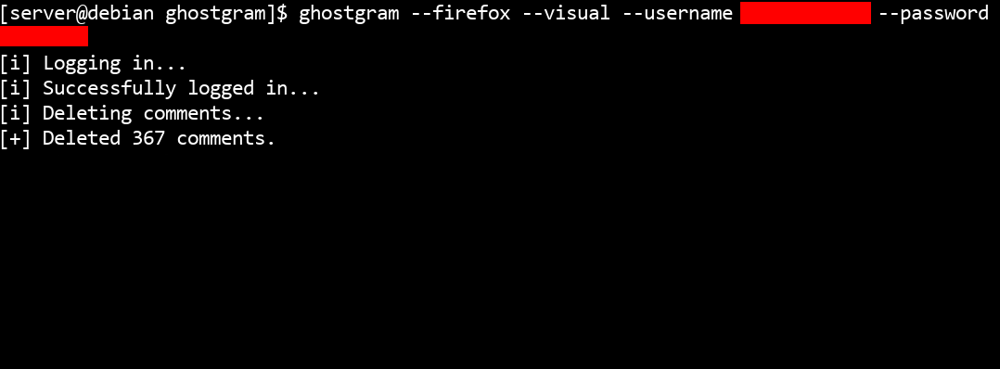

[]()
[](https://www.python.org/)


[](LICENSE)
[]()

# Ghostgram - Instagram Comment Deleter (Beta)

Ghostgram automates the process of deleting all your Instagram comments, since Instagram does not provide an option to do this instantly.



---

## ⚠️ Note

Instagram ToS prohibits the use of bots or automation. Use this tool at your own risk. This tool is **not official** and **not affiliated** with Instagram.

---

## Before Using

You will need a **WebDriver** installed for the browser you plan to use:  

- **Firefox** (GeckoDriver)  
- **Chrome** (ChromeDriver)  

---

## Installation

```
$ git clone https://github.com/yourusername/ghostgram
$ cd ghostgram
$ pip3 install . --break-system-packages
```

---

## Usage

Run Ghostgram with the following command:  

```
ghostgram --firefox --visual --username YOUR_USERNAME --password YOUR_PASSWORD
```

### Options

```
usage: ghostgram [-h] [--firefox] [--chrome] [--visual] --username USERNAME --password PASSWORD

options:
  -h, --help           show this help message and exit
  --firefox            Use Firefox.
  --chrome             Use Chrome.
  --visual             Show browser UI.
  --username USERNAME  Instagram username.
  --password PASSWORD  Instagram password.
```

---

## Disclaimer

The author is **not responsible** for misuse, account bans, or any errors caused by this tool. Always follow **legal and privacy guidelines**.  

---

## Author

**Alejandro Cora**  
<https://github.com/alejandrocora>